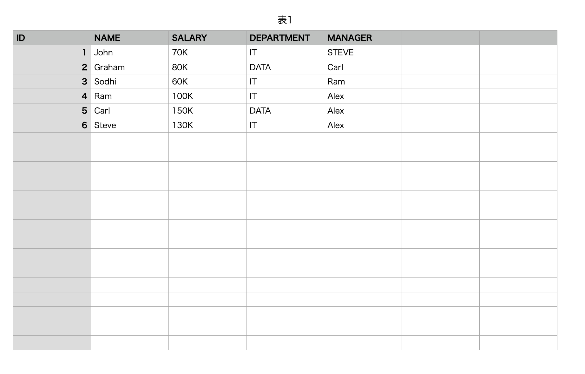
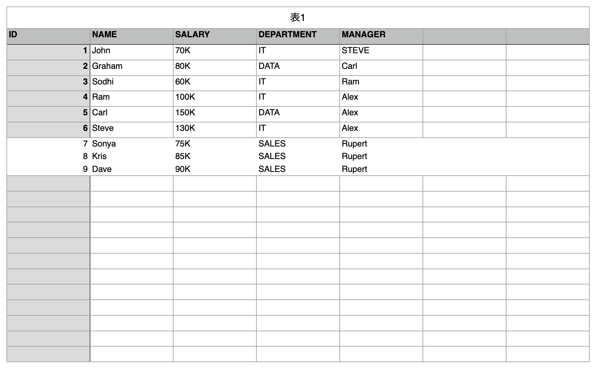

# How to read/write Excel .xlsx file using Apache POI in Katalon Studio

This is a small Katalon Studio for demonstration purpose. You can download the zip of this project form the [Release](https://github.com/kazurayam/HowToReadWriteXlsxFileUsingApachePoiInKatalonStudio/releases) page, unzip it, open it with your local Katalon Studio.

I developed this project using Katalon Studio v8.2.0 on Mac. This project is not KS version specific, not OS-dependent. It should work on every version of Katalon Studio, on Windows as well.

## Description

This project provides a working Test Case script which 
1. reads an Excel file `./Employee.xlsx`, print the data in the sheet into the console
2. updates the sheet with additional rows of data, write the workbook into another Excel file `./Employee.out.xlsx`

The source is here:
- [Test Cases/XLSXReaderWriter](Scripts/XLSXReaderWriter/Script1642118878582.groovy)

The input Excel sheet looks like: 
i
The output Excel sheet looks like: 

When I ran the Test Case I saw the following messages in the console:

```
2022-01-14 11:58:27.083 INFO  c.k.katalon.core.main.TestCaseExecutor   - START Test Cases/XLSXReaderWriter
表1	
ID	NAME	SALARY	DEPARTMENT	MANAGER	
1.0	John	70K	IT	STEVE	
2.0	Graham	80K	DATA	Carl	
3.0	Sodhi	60K	IT	Ram	
4.0	Ram	100K	IT	Alex	
5.0	Carl	150K	DATA	Alex	
6.0	Steve	130K	IT	Alex	


Writing into ./Employee.out.xlsx
2022-01-14 11:58:30.193 INFO  c.k.katalon.core.main.TestCaseExecutor   - END Test Cases/XLSXReaderWriter
```

## Motivation

The Test Case script calls the API of [Apache POI](https://poi.apache.org/) directly. This script aims to demonstrate a simple but working example how to use the POI API in Katalon Studio.

About the POI API, there are a lot of resources. So you should search and find articles that help you learn it more.

The latest verion of Apache POI is v5.0.x, but Katalon Studio v8.2.0 bundles fairly old version of Apache POI: 3.17. You should note this version difference, and mind not to be confused.

You would need to see the [Javadoc of POI v3.17](https://poi.apache.org/apidocs/3.17/) frequently.

## How I made it

The source code is originally published by vektorwebsolutions.com at the following site 

- https://vektorwebsolutions.com/how-to-read-write-xlsx-file-in-java-apach-poi-example/

The original was written in Java. I convert it into Katalon Studio's Test Case script in Groovy.

I modified the code just slightly as I found a few issues to be fixed.
